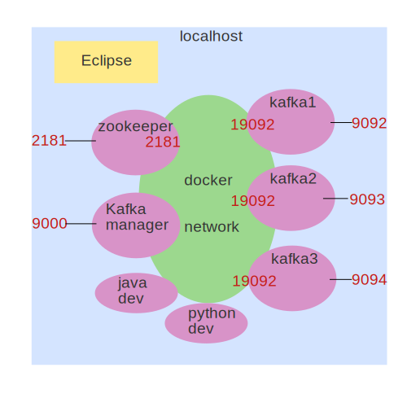

# Running Multi-Broker Kafka using Docker

This stack features: zookeeper + multiple kafka brokers + kafka manager UI + Java and Python dev enviroments + prometheus + grafna.

There are different configurations to fit your needs:

- minimal : 1 zookeeper + 1 kafka broker + kafka manager UI
- multi node: 1 zookeeper + 3 kafka brokers + kafka manager UI
- full stack: 1 zookeeper + 3 kafka brokers + kafka manager UI + Prometheus + Grafana

## Quickstart: Clone this repo

```bash
$   git clone https://github.com/elephantscale/kafka-in-docker
```

## Quick start - Single Broker Kafka


[quickstart-single-broker.md](quickstart-single-broker.md)

## Quick Start - Multi Broker Kafka


[quickstart-multi-broker.md](quickstart-multi-broker.md)

## Quick start - Multi broker Kafka + Monitoring stack


This stack is **everything**.  Starts...

* 1 x zookeeper
* 3 x Kafka brokers
* Kafka UI Manager
* Monitoring stack
    - Prometheus (metrics database)
    - Grafana (visualizing metrics)
    - Caddy (proxying)
    - Node exporter (to collect host metrics)
    - Push gateway (to collect metrics)
    - 3 x JMX collectors (to collect Kafka metrics)

Read more: [quickstart-metrics.md](quickstart-metrics.md)

## Setup Explained



* Zookeeper container listens on port 2181 on localhost and docker network
* There are 3 kafka broker containers running
* Each Kafka broker has 2 listeners.
    - port 19092 for docker network
    - one of the ports 9092 or 9093 or 9094, that is mapped to localhost
* Kafka docker hostnames are `kafka1`, `kafka2`, `kafka3`
* All zookeeper/kafka containers are mapped to local volumes, so the data is safe

It may be a bit of complex setup.  But docker-compose makes it easy manage

## Developing Kafka Apps

[Sample Java app](work/sample-app-java/README.md)

[Sample python app](work/sample-app-python/README.md)

## A Note about permissions

`./work` directory is mounted on `java-dev` and 'python-dev` containers.  We mount this using current user id, so the files will have the correct permissions, even when created from within the container

In order for the permissions to work, you need to start these containers using the scripts like this:

```bash
$   ./start-java-dev.sh
$   ./start-python-dev.sh
```

## Checking running docker containers

```bash
# pick the correct docker-compose.yml
$   docker-compose  -f docker-compose-kafka-multi.yml   ps
```

## Reset Every thing

Delete the docker volumes to clear all zookeeper / broker data

```bash
# pick the correct docker-compose.yml
$   docker-compose  -f docker-compose-kafka-multi.yml   down -v
```

## Inspecting Data on Docker Volumes

```bash
# inspect docker volumes
$   docker volume ls

# say we want to examine this volume : kafka-in-docker_kafka1_data
$   docker run --rm -i -v=kafka-in-docker_kafka1_data:/volume busybox find /volume

# or
$   docker run --rm -i -v=kafka-in-docker_kafka1_data:/volume busybox find /volume -exec ls -l '{}' \;

# interactive
$   docker run --rm -it -v=kafka-in-docker_kafka1_data:/volume busybox ash
```

## Troubleshooting Kafka Broker Connectivity

I have adopted this excellent python script [python_kafka_test_client.py](https://github.com/rmoff/kafka-listeners/blob/master/python/python_kafka_test_client.py) with thanks!

**Running this script on host:**

I recommend creating a custom python environment, so we keep our python environments clean.

```bash
$   conda create --name pykafka python=3.8
$   conda activate pykafka
$   pip3 install confluent_kafka
```

Now run the script:

```bash
$   python python-dev/python_kafka_test_client.py 
```

**Running the python script in container**

```bash
$   bash ./start-python-dev.sh
# this will spin up our python dev container

# inside the container, execute this
# Note: we are specifying kafka broker and host that is exposed within docker network
$   python /python_kafka_test_client.py    kafka1:19092
```

## Some Changes

**Maven settings.xml**

[java/settings.xml](java/settings.xml) sets the default Maven repository to `/var/maven/.m2/repository`.  It is mapped to `/usr/share/maven/conf/settings.xml` on mvn image.

**Caddy**

We use Caddy for proxying traffic for Grafana and Prometheus.  This way the UIs work great in remote servers, not just localhost

## References

### Kafka Images

- [bitnami/kafka](https://hub.docker.com/r/bitnami/kafka) - This is the one I used
- [confluentinc/cp-kafka](https://hub.docker.com/r/confluentinc/cp-kafka) - Confluent community Kafka image

### Excellent guides that helped me

- The grafana / prometheus part is heavily borrowed, with much thanks, from [https://github.com/streamthoughts/kafka-monitoring-stack-docker-compose](https://github.com/streamthoughts/kafka-monitoring-stack-docker-compose) - a very nicely done monitoring stack for Kafka!
- https://www.confluent.io/blog/kafka-client-cannot-connect-to-broker-on-aws-on-docker-etc/
    - connecting from Eclipse
- https://github.com/rmoff/kafka-listeners
	- very nice writeup
	- brilliant python test client to troubleshoot conenectivity issues : https://github.com/rmoff/kafka-listeners/blob/master/python/python_kafka_test_client.py
- https://github.com/wurstmeister/kafka-docker - another attempt at dockerizing Kafka