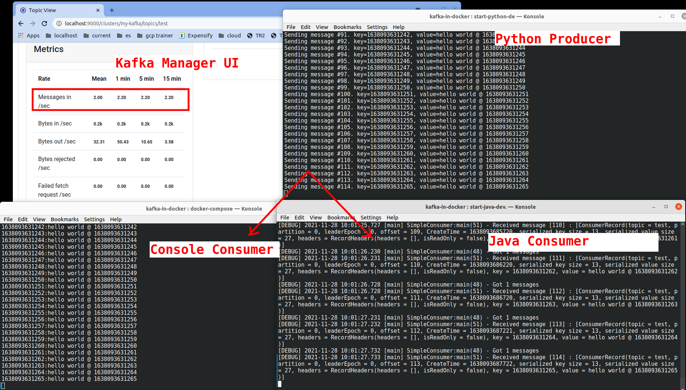

# Python + Java  Development Environment for Kafka

Easy to use dev environment for Kafka with handy utilities for Python and Java

This container has

* JDK 11 + Maven
* Python 3.9
* Confluent Python library
* And other utilities like kakacat

You can find it here: [elephantscale/kafka-dev @ Dockerhub](https://hub.docker.com/repository/docker/elephantscale/kafka-dev)

## Get this

```bash
# on docker host

$   docker   pull  elephantscale/kafka-dev
```

## Run it

Easiest way to run this docker container is use the handy script [run-kafka-dev.sh](run-kafka-dev.sh)

Here is the script:

```bash
export CURRENT_USER="${CURRENT_USER-$(id -u):$(id -g)}"

# make maven build dir, if doesn't exist
mkdir -p  $HOME/.m2

docker run -it --rm \
    --user $CURRENT_USER \
    --network  bobafett-net \
    -v $HOME/.m2:/var/maven/.m2  \
    -v $(pwd):/workspace:z   \
    -w /workspace \
    elephantscale/kafka-dev
```

Few notes:

* We are starting the docker container as `CURRENT_USER`,  so files created within the container will by owned by current user.  This is important when creating a compiling source code within the container.
* Also the current directory is mapped as `workspace` within the container.  It will be the default working directory.
* Also we are mounting the maven directory (`~/.m2`) into container.  This will reuse our downloaded maven artifacts within the container.  This will significantly speed up builds.

**Run it:**

```bash
# on docker host

$   git   clone   https://github.com/elephantscale/kafka-in-docker

$   bash kafka-dev/run-kafka-dev.sh
```

## Python Development

### Testing Kafka Connectivity

Start the container from the project root directory

```bash
# on docker host

$   cd   kafka-in-docker
$   ./kafka-dev/run-kafka-dev.sh
```

Now you are within the container.  We will try a quick python test

```bash
# within container

$   python /python_kafka_test_client.py   kafka1:19092
# if the cluster is running, it will connect to the cluster
```

### Sample Python Application

We have a sample python application in : `sample-app-python`

Start one instance of kafka-dev instance

```bash
# on docker host

$   cd   kafka-in-docker
$   bash kafka-dev/run-kafka-dev.sh
```

**First create a `test` topic**

Execute these within the kafka-dev container

```bash
# within container

$   kafka-topics.sh --bootstrap-server  kafka1:19092  --list
```

If there is not `test` topic create one as follows:

```bash
# within container

$  kafka-topics.sh --bootstrap-server kafka1:19092 \
     --create --topic test --replication-factor 1  --partitions 2
```

Within the container, run a consumer

```bash
# within container

$   cd sample-app-python
$   python  consumer.py
```

Start another instance of kafka-dev as follows:

```bash
# on docker host

$   cd   kafka-in-docker
$   bash kafka-dev/run-kafka-dev.sh
```

Within the container, run a producer

```bash
# within container

$   cd sample-app-python
$   python  producer.py
```

Watch the events flowing from producer to consumer



## Java App

We have a sample Java app in [sample-app-java](sample-app-java/)

Start Kafka dev env as follows:

```bash
# on docker host

$   cd kafka-in-docker
$   bash kafka-dev/run-kafka-dev.sh
```

Within container, try the following:

```bash
# within container

$   cd sample-app-java

# build the Java app
$   mvn  clean package

# Run Java consumer
$    java -cp target/hello-kafka-1.0-jar-with-dependencies.jar   x.SimpleConsumer
```

Start another kafka-dev instance as follows:

```bash
# on docker host

$   cd kafka-in-docker
$   bash ./kafka-dev/run-kafka-dev.sh
```

Within container, try the following:

```bash
# within container

$   cd sample-app-java

# build the Java app
$   mvn  clean package

# Run Java consumer
$    java -cp target/hello-kafka-1.0-jar-with-dependencies.jar   x.SimpleProducer
```

Watch the events flowing from producer to consumer

## Building  the Docker Image (Devs only)

```bash
# on docker host

$   docker   build .  -t elephantscale/kafka-dev

$   docker   build .  -t elephantscale/kafka-dev:1.0
```

Publish to docker hub

```bash
# on docker host

$   docker   login

$   docker   push   elephantscale/kafka-dev:1.0
$   docker   push   elephantscale/kafka-dev
```
