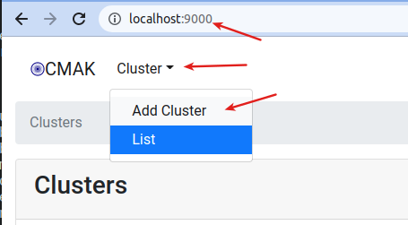
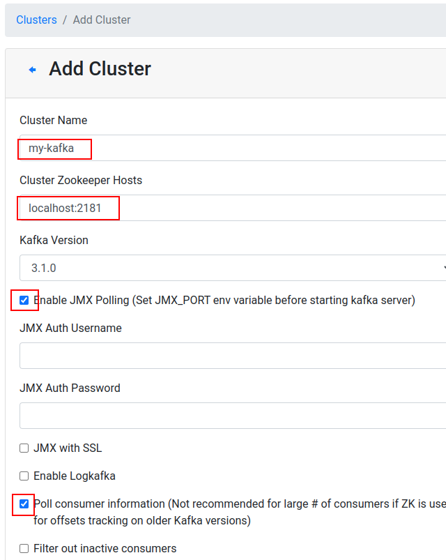
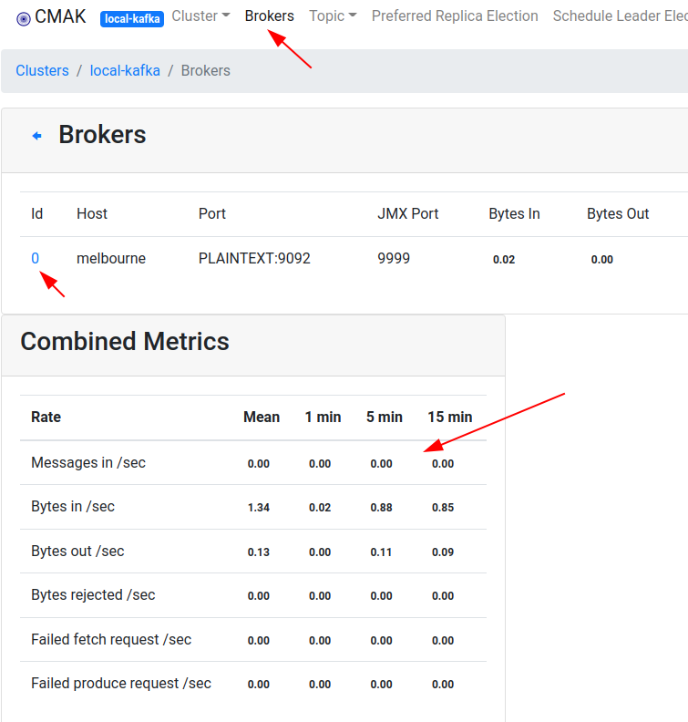

# Dockerized Yahoo CMAK (Formerly 'Kafka Manager')

This is the popular [Yahoo CMAK](https://github.com/yahoo/CMAK)

[elephantscale/kafka-manager @ dockerhub](https://hub.docker.com/r/elephantscale/kafka-manager)

## Download this

```bash
$   docker pull  elephantscale/kafka-manager
```

## Running on Single Kafka Instance

### Start kafka on your local machine

```bash
# Go to where your Kafka is installed
$   cd ~/apps/kafka  # or cd  /path/to/kafka

# start zookeeper
$    bin/zookeeper-server-start.sh    config/zookeeper.properties

# start kafka
$   JMX_PORT=9999  bin/kafka-server-start.sh -daemon \
        config/server.properties
```

### Now Start Kafka Manager  

A few things to note

* The default configuration looks for zookeeper in `localhost:2181,zookeeper:2181`
* You want to start the networking in `host` mode.  This way it can find zookeeper  at `localhost:2181`
* And map the port 9000 to container
* And we are naming our container `kafka-manager` for easy identification

```bash
$   docker run -d --rm --name kafka-manager -p 9000:9000 \
               --net host  \
               elephantscale/kafka-manager
```

Go to [localhost:9000](http://localhost:9000) in your browser and you will see kafka-manager UI!

See [Using kafka-manager](#using-kafka-manager) section below.

### Stopping Kafka Manager Container

```bash
$   docker stop kafka-manager  # if you named the container as kafka-manager

# or 
$   docker ps
# identify the kafka-manager container id
$   docker stop   aaaabbbbccc
```

## Using Kafka Manager

### Register a Kafka Cluster



### Register a Kafka Cluster with these Properties

* Cluster name: can be anything you want
* zookeeeper name: must be `localhost:2181`
* Enable JMX polling
* Enable consumer polling



### Click around and enjoy

For example, if you click on `Brokers` you will start seeing JMX stats showing up!



## To Build Docker Image (Devs only)

```bash
$   docker build .  -t elephantscale/kafka-manager
$   docker build .  -t elephantscale/kafka-manager:3.0.0.6
```

Pushing to docker hub

```bash
$   docker login
$   docker push  elephantscale/kafka-manager
$   docker push  elephantscale/kafka-manager:3.0.0.6
```
