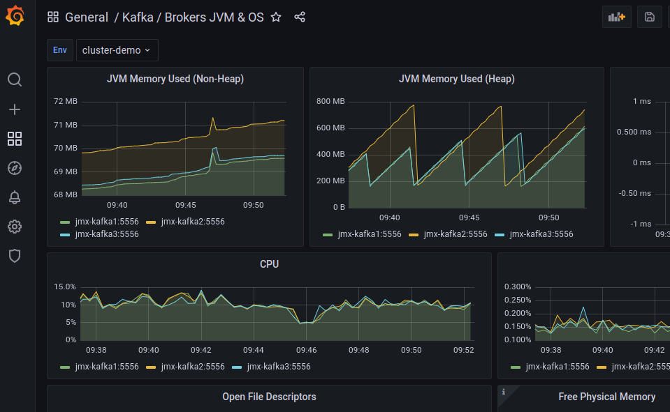
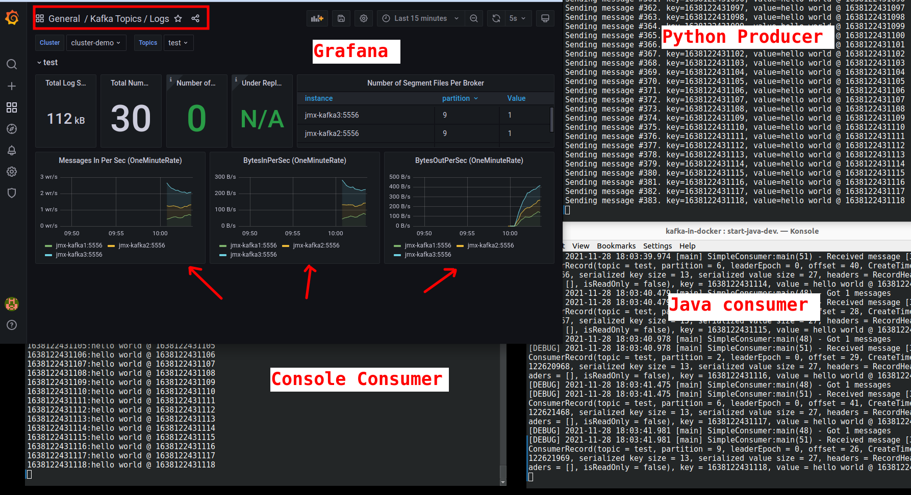

# Quickstart - Multi Node Kafka With Monitoring

## Overview


This stack is **everything**.  Starts...

* 1 x zookeeper
* 3 x Kafka brokers
* Kafka UI Manager
* Monitoring stack
    - Prometheus (metrics database)
    - Grafana (visualizing metrics)
    - Caddy (proxying)
    - Node exporter (to collect host metrics)
    - Push gateway (to collect metrics)
    - 3 x JMX collectors (to collect Kafka metrics)


## Step-1: Start the stack

```bash
# on docker host

$   cd kafka-in-docker
$   bash start-kafka-full.sh
```

## Step-2: Kafka Manager UI

Access Kafka Manager UI on url : [http://localhost:9000](http://localhost:9000)

Register our new Kafka cluster as follows


Once registered, you will see topics and brokers displayed like this.


Click on the brokers, and you will see broker details.  You can also see JMX metrics are published!


Click on broker id, to see more detailed stats on a broker.


## Step-3: Login to a Kafka broker

Login to a kafka node

```bash
# on docker host

$   cd kafka-in-docker
$   docker-compose  -f docker-compose-kafka-metrics.yml  exec  kafka1  bash
```

## Step-4: Create a Test Topic

We do this **within the `kafka1` container**, we just started.

```bash
# within container

# See current topics
$    kafka-topics.sh --bootstrap-server kafka1:19092  --list

# Create a new topic
$   kafka-topics.sh  --bootstrap-server kafka1:19092   \
       --create --topic test --replication-factor 3  --partitions 10

# Describe topic
$   kafka-topics.sh  --bootstrap-server kafka1:19092   \
       --describe --topic test 
```

## Step-5: Start Console Consumer

We do this **within the `kafka1` container**, we just started.

```bash
# within container

$    kafka-console-consumer.sh --bootstrap-server kafka1:19092   \
         --property print.key=true --property key.separator=":"  --topic test

```

Note, our kafka bootstrap server is `kafka1:19092`, this is the advertised kafka broker address in docker network.

## Step-6: Start Console Producer

On another terminal, login to another Kafka node

```bash
# on docker host

$   cd kafka-in-docker
$   docker-compose -f docker-compose-kafka-metrics.yml  exec kafka2  bash
```

Within the kafka container, start the console producer

Run producer


```bash
# within container

$    kafka-console-producer.sh --bootstrap-server kafka2:19092  --topic test
```

Type a few lines into console producer terminal

```text
1
2
3
4
```

And watch it come out on console terminal

## Step-7: Checkout Metrics

This stack has has a full compliment of monitoring tools.

Checkout Prmometheus UI at [localhost:9090](http://localhost:9090) .  Here we see all data sources are up and running.


## Step-8: Visualize with Grafana

Grafana UI is [localhost:3000](http://localhost:3000)

Login with credentials:

- username: admin
- password: kafka

Here is a sample Grafana UI with pre-defined dashboards.


### Kafka / Brokers JVM & OS  Dashboard



### Kafka Cluster / Global Healthcheck Dashboard


### Kafka Topics Dashboard



## Step-9: Developing Applications

See [application development guide](kafka-dev/README.md)

## Step-10: Shutdown

```bash
$   bash ./stop-kafka-full.sh
```
