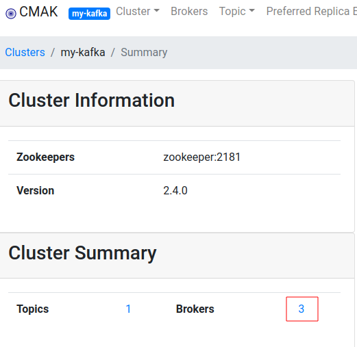
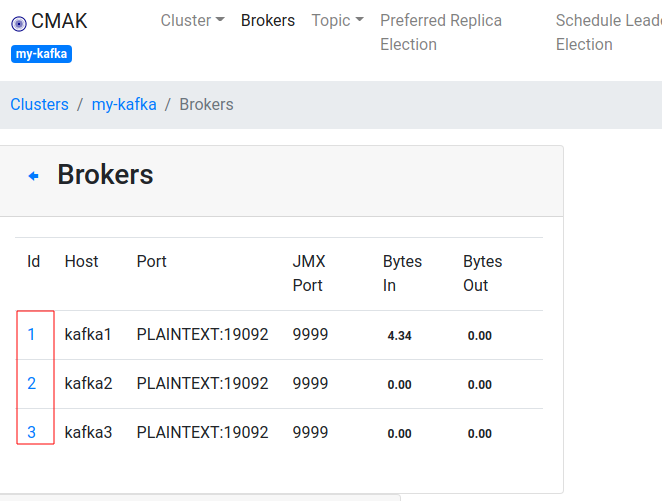
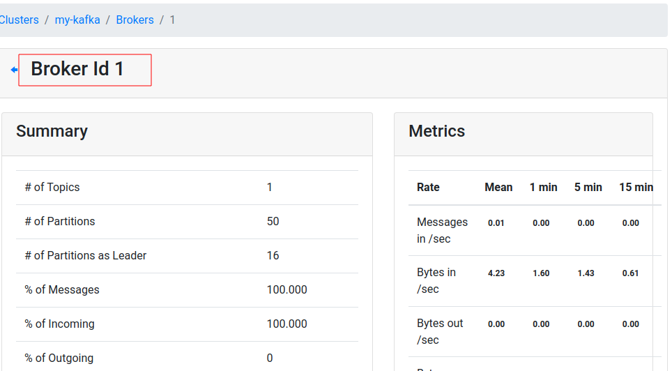

# Quickstart - Multi Node Kafka

## Overview

Components started:


This stack has:

- 1 x Zookeeper
- 3 x Kafka brokers
- Kafka UI Manager

## Step-1: Start the stack

```bash
# on docker host

$   cd   kafka-in-docker
$   bash start-kafka-multi.sh
```

## Step-2: Login to a Kafka broker

Login to a kafka node

```bash
# on docker host
$   cd   kafka-in-docker

$   docker-compose  -f docker-compose-kafka-multi.yml  exec  kafka1  bash
```

## Step-3: Create a Test Topic

We do this **within the `kafka1` container**, we just started.

```bash
# within docker container

# See current topics
$    kafka-topics.sh --bootstrap-server kafka1:19092  --list

# Create a new topic
$   kafka-topics.sh  --bootstrap-server kafka1:19092   \
       --create --topic test --replication-factor 3  --partitions 10

# Describe topic
$   kafka-topics.sh  --bootstrap-server kafka1:19092   \
       --describe --topic test 
```

## Step-4: Start Console Consumer

We do this **within the `kafka1` container**, we just started.

```bash
# within docker container

$    kafka-console-consumer.sh  --bootstrap-server kafka1:19092   \
         --property print.key=true --property key.separator=":"  --topic test
```

Note, our kafka bootstrap server is `kafka1:19092`, this is the advertised kafka broker address in docker network.

## Step-5: Start Console Producer

On another terminal, login to another Kafka node

```bash
# on docker host

$   cd   kafka-in-docker

$   docker-compose -f docker-compose-kafka-multi.yml  exec kafka2  bash
```

Within the kafka container, start the console producer

Run producer

```bash
# within docker container

$    kafka-console-producer.sh --bootstrap-server kafka2:19092  --topic test
```

Type a few lines into console producer terminal

```text
1
2
3
4
```

And watch it come out on console terminal

## Step-6: Kafka Manager UI

Access Kafka Manager UI on url : [http://localhost:9000](http://localhost:9000)

Register our new Kafka cluster as follows


Once registered, you will see topics and brokers displayed like this.



Click on the brokers, and you will see broker details.  You can also see JMX metrics are published!



Click on broker id, to see more detailed stats on a broker.



## Step-7: Shutdown

```bash
# on docker host

$   bash ./stop-kafka-multi.sh
```

## Step-8: Developing Applications

See [application development guide](kafka-dev/README.md)