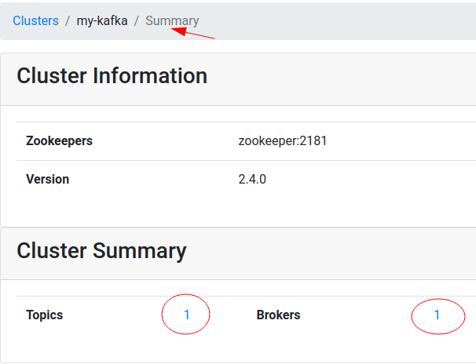

# Quickstart - Single Node Kafka

## Overview

Components started :


This stack has:

- 1 x Zookeeper
- 1 x Kafka broker
- Kafka UI Manager

## Step-1: Start the stack

```bash
# on docker host
$   cd  kafka-in-docker
$   bash start-kafka-single.sh
```

## Step-2: Kafka Manager UI

Access Kafka Manager UI on url : [http://localhost:9000](http://localhost:9000)

Register our new Kafka cluster as follows

- Cluster name : `kafka1`  (anything you like)
- Zookeeper : `zookeeper:2181`  (must be exact)
- Enable `JMX polling`
- Enable `consumer polling`


Once registered, you will see topics and brokers displayed like this.



Click on the brokers, and you will see broker details.  You can also see JMX metrics are published!


Click on broker id, to see more detailed stats on a broker.


## Step-3: Login to a Kafka broker

```bash
# on docker host

$   docker-compose -f docker-compose-kafka-single.yml  exec kafka1  bash
```

## Step-4: Create a Test Topic

We do this **within the `kafka1` container**, we just started.

Note, our kafka bootstrap server is `kafka1:19092`, this is the advertised kafka broker address in docker network.

```bash
# within docker container

# See current topics
$    kafka-topics.sh --bootstrap-server kafka1:19092  --list

# Create a new topic
$   kafka-topics.sh   --bootstrap-server kafka1:19092   \
       --create --topic test --replication-factor 1  --partitions 2

# Describe topic
$   kafka-topics.sh  --bootstrap-server kafka1:19092   \
       --describe --topic test 
```

## Step-5: Start Console Consumer

We do this **within the `kafka1` container**, we just started.

```bash
# within docker container

$    kafka-console-consumer.sh  --bootstrap-server kafka1:19092   \
         --property print.key=true --property key.separator=":"  --topic test

```

## Step-6: Start Console Producer

On another terminal, login to Kafka node again

```bash
# on docker host

$   docker-compose -f docker-compose-kafka-single.yml  exec kafka1  bash
```

Within the kafka container, start the console producer

Run producer

```bash
# within docker container

$    kafka-console-producer.sh --bootstrap-server kafka1:19092  --topic test
```

Type a few lines into console producer terminal

```text
1
2
3
4
```

And watch it come out on console terminal

## Step-7: Using kcat (KafkaCat)

[kcat](https://github.com/edenhill/kcat)  is a very handy utillity for Kafka

We can run it by running the [elephantscale/kafka-dev](https://hub.docker.com/repository/docker/elephantscale/kafka-dev)

### Start kafka-dev container

```bash
# on docker host

$   cd   kafka-in-docker
$   ./kafka-dev/run-kafka-dev.sh
```

Within the kafka-dev container, check if kcat is working fine...

```bash
# within docker container

$    kafkacat -L   -b   kafka1:19092
```

Within kafka-dev container, start a consumer

```bash
# within docker container

$   kafkacat   -b kafka1:19092  -t test  -K :   -C
```

### Start another kafka-dev instance

Start another 'kafka-dev` instance as follows

```bash
# on docker host

$   cd   kafka-in-docker
$   ./kafka-dev/run-kafka-dev.sh
```

In the other kafka-dev instance, start producer

```bash
# within docker container

$   kafkacat   -b kafka1:19092  -t test  -K :   -P
```

Type data like this, in key-value format, in the producer terminal

```text
a:1
b:1
a:2
b:2
```

And see it come out on the kafkacat consumer terminal

## Step-8: Shutdown

```bash
# on docker host

$   bash ./stop-kafka-single.sh
```

## Step-9: Developing Applications

See [application development guide](kafka-dev/README.md)